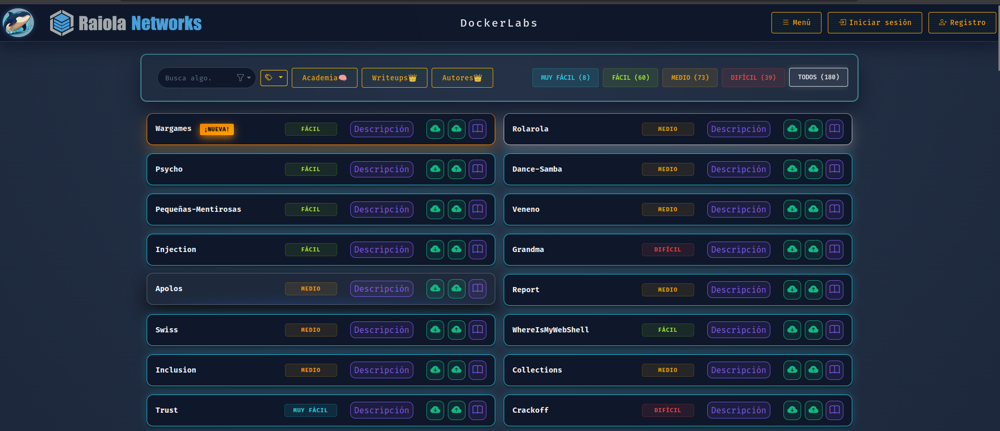
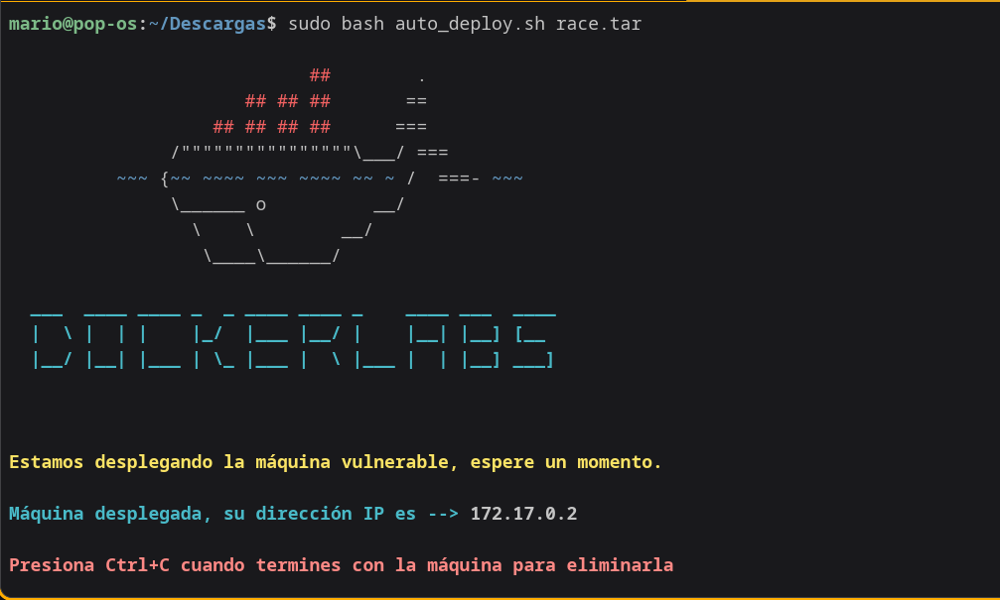

<div align="center">
  

  # DockerLabs
  
  **La Plataforma Definitiva para Entrenar tus Habilidades de Hacking Ético**

  [](https://github.com/Maalfer/dockerlabs/stargazers)
  [](https://github.com/Maalfer/dockerlabs/network/members)
  [](https://www.python.org/)
  [](https://flask.palletsprojects.com/)
  [](https://www.docker.com/)

  <br>

  <p align="center">
    <strong>DockerLabs</strong> facilita el despliegue de laboratorios vulnerables en segundos usando el poder de los contenedores Docker. <br>
    Ligero, rápido y diseñado para la comunidad.
  </p>
</div>

---

## 🚀 ¿Qué es DockerLabs?

DockerLabs es una plataforma web open-source que permite a los usuarios **desplegar, practicar y aprender** ciberseguridad sin las complicaciones de configurar máquinas virtuales pesadas. Con un solo clic, puedes lanzar entornos vulnerables aislados, listos para ser explotados.

Olvídate de descargas de 4GB. DockerLabs levanta máquinas en milisegundos.

---

## ✨ Características Principales

| 🐳 **Eficiencia Docker** | 🎯 **Máquinas Variadas** | 🤝 **Comunidad** |
| :--- | :--- | :--- |
| Entornos ultraligeros que consumen recursos mínimos. Levanta 10 laboratorios donde antes solo cabía una VM. | Desde máquinas *Very Easy* hasta retos *Hard*. Filtra por dificultad, fecha, creador y mucho más. | Sube tus propios **Writeups**, valora las máquinas y compite en el ranking global. |

<div align="center">
  
  <p><em>Interfaz moderna para la gestión de máquinas y writeups</em></p>
</div>

---

## 🛠️ Tecnologías

Un stack robusto y moderno para garantizar rendimiento y escalabilidad.

<div align="center">
  
  
  
  
  
  
</div>

---

## 💻 Instalación y Despliegue Local

¡Empieza en minutos!

1.  **Clona el repositorio:**
    ```bash
    git clone https://github.com/Maalfer/dockerlabs.git
    cd dockerlabs
    ```

2.  **Configura el entorno:**
    Crea un entorno virtual e instala las dependencias.
    ```bash
    python3 -m venv venv
    source venv/bin/activate
    pip install -r requirements.txt
    ```

3.  **Configura las variables de entorno:**
    ```bash
    cp .env.example .env
    # Edita .env con tu SECRET_KEY
    ```

4.  **Ejecuta la aplicación:**
    ```bash
    python3 app.py
    ```

<div align="center">
  
</div>

---

> [!NOTE]
> **Información crítica de despliegue a continuación.**

## ⚙️ DESPLIEGUE NORMAL (Producción)

Para desplegar dockerlabs en producción con Apache, estos son los permisos necesarios:

```bash
sudo chown -R www-data:www-data /var/www/dockerlabs
sudo find /var/www/dockerlabs -type d -exec chmod 755 {} \;
sudo find /var/www/dockerlabs -type f -exec chmod 644 {} \;
sudo chmod 775 /var/www/dockerlabs
sudo chmod 775 /var/www/dockerlabs/database
sudo chmod 664 /var/www/dockerlabs/database/dockerlabs.db
sudo chmod +x /var/www/dockerlabs/venv/bin/uvicorn
sudo systemctl restart dockerlabs.service
```

### Rate Limiting (Memcached)

Para el funcionamiento correcto del sistema de limitación de peticiones (Rate Limit), es necesario tener **memcached** activado:

```bash
sudo apt install memcached
sudo systemctl enable memcached
sudo systemctl start memcached
```

### Auditoría Local (Admin)

Si queremos auditar dockerlabs en local con un usuario que tenga rol de admin, debemos añadir en el `app.py` el siguiente endpoint y después visitar dicha ruta:

```python
@app.route('/make-me-admin')
def make_me_admin():
    user_id = session.get('user_id')
    if not user_id:
        return "Debes iniciar sesión para convertirte en admin.", 401
    db = get_db()
    db.execute(
        "UPDATE users SET role = 'admin' WHERE id = ?",
        (user_id,)
    )
    db.commit()

    return "Ahora eres admin."
```

### 🧪 Poblar Datos de Prueba

Para facilitar el desarrollo y pruebas locales, hemos incluido un script que **crea automáticamente máquinas, usuarios, writeups y valoraciones de prueba**. Este script es especialmente útil cuando quieres probar funcionalidades sin tener que crear manualmente los datos.

**¿Qué crea el script?**

- **~180 máquinas DockerLabs** con diferentes niveles de dificultad (Muy Fácil, Fácil, Medio, Difícil).
- **~50 máquinas BunkerLabs** con PINs y configuraciones variadas.
- **50 usuarios** con roles distintos (admin, moderador, jugador).
- **~200 writeups** de ejemplo distribuidos entre las máquinas.
- **Valoraciones** realistas.

**Uso:**

```bash
# Asegúrate de tener el entorno virtual activado
source venv/bin/activate

# Ejecuta el script
python3 populate_datos.py
```

El script detectará automáticamente si los datos ya existen y evitará duplicados o actualizará la información necesaria.

> [!TIP]
> Este script es ideal para entornos de desarrollo. **No lo ejecutes en producción** a menos que sepas exactamente lo que estás haciendo.

<details>
<summary><strong>📄 Ver código completo del script (populate_datos.py)</strong></summary>

```python
import random
import string
from datetime import datetime, timedelta
from dockerlabs.app import app
from dockerlabs.extensions import db
from dockerlabs.models import User, Machine, Category, Writeup
from werkzeug.security import generate_password_hash

# Configuración
NUM_USERS = 50
NUM_DOCKER_MACHINES = 180
NUM_BUNKER_MACHINES = 50
NUM_WRITEUPS = 200

# Datos aleatorios
DIFICULTADES = ["Muy Fácil", "Fácil", "Medio", "Difícil"]
CLASES = ["Linux"]
COLORES = {
    "Muy Fácil": "#43959b",
    "Fácil": "#8bc34a",
    "Medio": "#e0a553",
    "Difícil": "#d83c31"
}
AUTORES = ["ElPingüino", "L0ck3r", "TheArchitect", "CyberPunk", "NetRunner", "RootAdmin", "GhostInShell", "Neo", "Trinity", "Morpheus"]
CATEGORIAS = ["Iniciación", "Active Directory", "Pivoting", "WebApp", "Forensic", "Crypto", "Reversing", "Pwn", "Mobile", "Cloud"]
ROLES = ["jugador", "jugador", "jugador", "moderador", "admin"] # Más probabilidad de jugador

def generate_random_string(length=10):
    return ''.join(random.choices(string.ascii_letters + string.digits, k=length))

def generate_random_date():
    start_date = datetime(2023, 1, 1)
    end_date = datetime.now()
    random_date = start_date + timedelta(days=random.randint(0, (end_date - start_date).days))
    return random_date.strftime("%d/%m/%Y")

def populate_users():
    print(f"Generando {NUM_USERS} usuarios...")
    
    # Usuarios fijos
    fixed_users = [
        {"username": "admin", "email": "admin@dockerlabs.es", "role": "admin"},
        {"username": "moderador", "email": "moderador@dockerlabs.es", "role": "moderador"},
        {"username": "jugador", "email": "jugador@dockerlabs.es", "role": "jugador"}
    ]

    for user_data in fixed_users:
        if not User.query.filter_by(username=user_data["username"]).first():
            new_user = User(
                username=user_data["username"],
                email=user_data["email"],
                password_hash=generate_password_hash(user_data["username"]), # Password is same as username
                role=user_data["role"],
                recovery_pin_plain="123456",
                recovery_pin_hash=generate_password_hash("123456"),
                recovery_pin_created_at=datetime.utcnow()
            )
            db.session.add(new_user)
    
    # Usuarios aleatorios
    for i in range(NUM_USERS):
        username = f"user_{generate_random_string(5)}"
        email = f"{username}@example.com"
        role = random.choice(ROLES)
        
        if not User.query.filter_by(username=username).first():
            new_user = User(
                username=username,
                email=email,
                password_hash=generate_password_hash("password123"),
                role=role,
                recovery_pin_plain="123456",
                recovery_pin_hash=generate_password_hash("123456"),
                recovery_pin_created_at=datetime.utcnow()
            )
            db.session.add(new_user)
    
    db.session.commit()
    print("Usuarios generados.")

def populate_machines():
    print(f"Generando máquinas...")
    
    # Mapping difficulty to class
    difficulty_to_class = {
        "Muy Fácil": "muy-facil",
        "Fácil": "facil",
        "Medio": "medio",
        "Difícil": "dificil"
    }

    # --- DockerLabs ---
    print(f"  - {NUM_DOCKER_MACHINES} máquinas DockerLabs...")
    for i in range(NUM_DOCKER_MACHINES):
        nombre = f"Docker_{generate_random_string(6)}"
        dificultad = random.choice(DIFICULTADES)
        clase = difficulty_to_class[dificultad]
        color = COLORES[dificultad]
        autor = random.choice(AUTORES)
        fecha = generate_random_date()
        categoria = random.choice(CATEGORIAS)
        
        if not Machine.query.filter_by(nombre=nombre).first():
            new_machine = Machine(
                nombre=nombre,
                dificultad=dificultad,
                clase=clase,
                color=color,
                autor=autor,
                enlace_autor=f"https://github.com/{autor}",
                fecha=fecha,
                imagen="logo.png",
                descripcion=f"Máquina {dificultad} de Linux creada por {autor}. Entorno Docker.",
                link_descarga=f"https://dockerlabs.es/machines/{nombre.lower()}.zip",
                posicion="izquierda" if i % 2 == 0 else "derecha",
                origen="docker",
                guest_access=False
            )
            db.session.add(new_machine)
            db.session.flush()
            
            new_category = Category(
                machine_id=new_machine.id,
                origen="docker",
                categoria=categoria
            )
            db.session.add(new_category)

    # --- BunkerLabs ---
    print(f"  - {NUM_BUNKER_MACHINES} máquinas BunkerLabs...")
    for i in range(NUM_BUNKER_MACHINES):
        nombre = f"Bunker_{generate_random_string(6)}"
        dificultad = random.choice(DIFICULTADES)
        clase = difficulty_to_class[dificultad]
        color = COLORES[dificultad]
        autor = random.choice(AUTORES)
        fecha = generate_random_date()
        categoria = random.choice(CATEGORIAS)
        pin = f"{random.randint(1000, 9999)}"
        
        if not Machine.query.filter_by(nombre=nombre).first():
            new_machine = Machine(
                nombre=nombre,
                dificultad=dificultad,
                clase=clase,
                color=color,
                autor=autor,
                enlace_autor=f"https://linkedin.com/in/{autor}",
                fecha=fecha,
                imagen="logo.png",
                descripcion=f"Máquina {dificultad} de Linux en entorno real (Bunker). PIN: {pin}",
                link_descarga=f"http://192.168.1.{random.randint(10, 250)}",
                posicion="izquierda" if i % 2 == 0 else "derecha",
                origen="bunker",
                pin=pin,
                guest_access=random.choice([True, False])
            )
            db.session.add(new_machine)
            db.session.flush()
            
            new_category = Category(
                machine_id=new_machine.id,
                origen="bunker",
                categoria=categoria
            )
            db.session.add(new_category)

    db.session.commit()
    print("Máquinas generadas.")

def populate_writeups():
    print(f"Generando {NUM_WRITEUPS} writeups...")
    machines = Machine.query.all()
    if not machines:
        print("No hay máquinas para generar writeups.")
        return

    for i in range(NUM_WRITEUPS):
        machine = random.choice(machines)
        autor = f"Writeuper_{generate_random_string(4)}"
        tipo = random.choice(["texto", "video"])
        url = f"https://writeups.com/{autor}/{machine.nombre}" if tipo == "texto" else f"https://youtube.com/watch?v={generate_random_string(11)}"
        
        # Check uniqueness manually or rely on try-except if using flush, but query is safer here
        # Constraint is (maquina, autor, url)
        if not Writeup.query.filter_by(maquina=machine.nombre, autor=autor, url=url).first():
            new_writeup = Writeup(
                maquina=machine.nombre,
                autor=autor,
                url=url,
                tipo=tipo,
                created_at=datetime.utcnow() - timedelta(days=random.randint(0, 365))
            )
            db.session.add(new_writeup)
    
    db.session.commit()
    print("Writeups generados.")

if __name__ == "__main__":
    with app.app_context():
        print("Iniciando población MASIVA de datos...")
        try:
            populate_users()
            populate_machines()
            populate_writeups()
            print("Población MASIVA finalizada con éxito.")
        except Exception as e:
            db.session.rollback()
            print(f"Error durante la población: {e}")
            import traceback
            traceback.print_exc()
```

</details>

## 🐳 DESPLIEGUE EN DOCKER

Para construir una imagen de Docker y lanzar la aplicación contenizada, ejecutaremos los siguientes comandos:

```bash
docker build -t dockerlabs .
docker run -d -p 5000:5000 --name dockerlabs dockerlabs
```

## 👷Como contribuir en DockerLabs
En [CONTRIBUTING.md](/CONTRIBUTING.md) indicamos todos los detalles para poder contribuir en [DockerLabs](https://dockerlabs.es).

---

<div align="center">
  <h2>🌟 Historia de Estrellas</h2>
  
</div>
